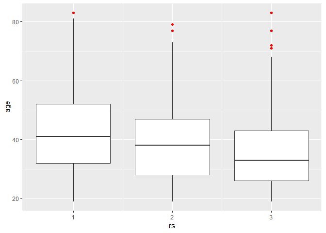
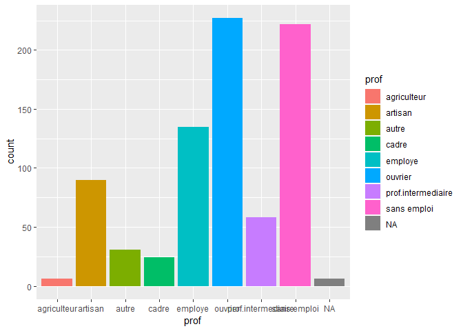
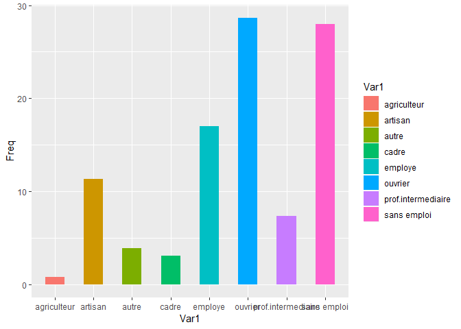
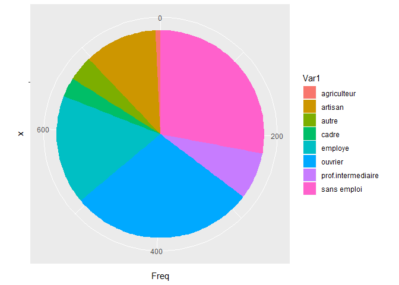
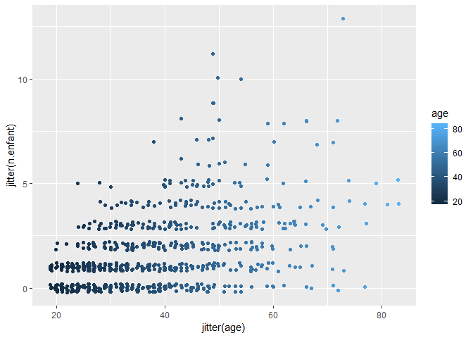
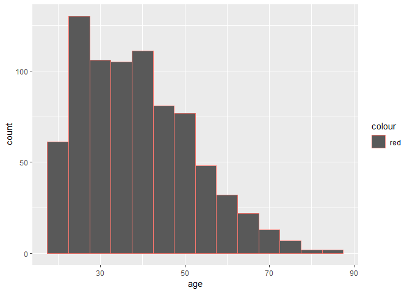

## Example Chi-2 test 

### With 100 people in each group


```r
p.Mal <- c(.7, .6)
p.Gue <- c(.3, .4)
p.matrix <- matrix(data = c(p.Gue*100, p.Mal*100), ncol = 2)
p.matrix
```

```
##      [,1] [,2]
## [1,]   30   70
## [2,]   40   60
```

```r
chisq.test(x= p.matrix,correct = FALSE)
```

```
## 
## 	Pearson's Chi-squared test
## 
## data:  p.matrix
## X-squared = 2.1978, df = 1, p-value = 0.1382
```
### With 200 individuals in each group

```r
p.matrix <- matrix(data = c(p.Gue*200, p.Mal*200), ncol = 2)
p.matrix
```

```
##      [,1] [,2]
## [1,]   60  140
## [2,]   80  120
```

```r
chisq.test(x= p.matrix,correct = FALSE)
```

```
## 
## 	Pearson's Chi-squared test
## 
## data:  p.matrix
## X-squared = 4.3956, df = 1, p-value = 0.03603
```


### With 1000 individuals in each group

```r
p.matrix <- matrix(data = c(p.Gue*1000, p.Mal*1000), ncol = 2)
p.matrix
```

```
##      [,1] [,2]
## [1,]  300  700
## [2,]  400  600
```

```r
chisq.test(x= p.matrix,correct = FALSE)
```

```
## 
## 	Pearson's Chi-squared test
## 
## data:  p.matrix
## X-squared = 21.978, df = 1, p-value = 2.758e-06
```


## Load data from csv file


```r
smp <- read.csv2("./smp1.csv")

smp2 <- read.csv2("./smp2.csv")
```

## See statistics for smp

```r
summary(smp)
```

```
##       age                       prof        dep.cons         scz.cons     
##  Min.   :19.0   ouvrier           :227   Min.   :0.0000   Min.   :0.0000  
##  1st Qu.:28.0   sans emploi       :222   1st Qu.:0.0000   1st Qu.:0.0000  
##  Median :37.0   employe           :135   Median :0.0000   Median :0.0000  
##  Mean   :38.9   artisan           : 90   Mean   :0.3967   Mean   :0.0826  
##  3rd Qu.:48.0   prof.intermediaire: 58   3rd Qu.:1.0000   3rd Qu.:0.0000  
##  Max.   :83.0   (Other)           : 61   Max.   :1.0000   Max.   :1.0000  
##  NA's   :2      NA's              :  6                                    
##    grav.cons        n.enfant            rs              ed       
##  Min.   :1.000   Min.   : 0.000   Min.   :1.000   Min.   :1.000  
##  1st Qu.:2.000   1st Qu.: 0.000   1st Qu.:1.000   1st Qu.:1.000  
##  Median :4.000   Median : 1.000   Median :2.000   Median :2.000  
##  Mean   :3.643   Mean   : 1.755   Mean   :2.057   Mean   :1.866  
##  3rd Qu.:5.000   3rd Qu.: 3.000   3rd Qu.:3.000   3rd Qu.:3.000  
##  Max.   :7.000   Max.   :13.000   Max.   :3.000   Max.   :3.000  
##  NA's   :4       NA's   :26       NA's   :103     NA's   :107    
##        dr       
##  Min.   :1.000  
##  1st Qu.:1.000  
##  Median :2.000  
##  Mean   :2.153  
##  3rd Qu.:3.000  
##  Max.   :3.000  
##  NA's   :111
```

```r
describe(smp)
```

```
## Description of smp
```

```
## 
##  Numeric 
##            mean median    var    sd valid.n
## age       38.90     37 176.38 13.28     797
## dep.cons   0.40      0   0.24  0.49     799
## scz.cons   0.08      0   0.08  0.28     799
## grav.cons  3.64      4   2.73  1.65     795
## n.enfant   1.76      1   3.36  1.83     773
## rs         2.06      2   0.77  0.88     696
## ed         1.87      2   0.76  0.87     692
## dr         2.15      2   0.69  0.83     688
## 
##  Factor 
##          
## prof      ouvrier sans emploi employe artisan prof.intermediaire autre
##   Count    227.00      222.00   135.0   90.00              58.00 31.00
##   Percent   28.41       27.78    16.9   11.26               7.26  3.88
##          
## prof      cadre agriculteur <NA>
##   Count      24        6.00 6.00
##   Percent     3        0.75 0.75
## Mode ouvrier
```

```r
describe(smp, num.desc = c("mean", "median", "sd", "min", "max", "valid.n"))
```

```
## Description of smp
```

```
## 
##  Numeric 
##            mean median    sd min max valid.n
## age       38.90     37 13.28  19  83     797
## dep.cons   0.40      0  0.49   0   1     799
## scz.cons   0.08      0  0.28   0   1     799
## grav.cons  3.64      4  1.65   1   7     795
## n.enfant   1.76      1  1.83   0  13     773
## rs         2.06      2  0.88   1   3     696
## ed         1.87      2  0.87   1   3     692
## dr         2.15      2  0.83   1   3     688
## 
##  Factor 
##          
## prof      ouvrier sans emploi employe artisan prof.intermediaire autre
##   Count    227.00      222.00   135.0   90.00              58.00 31.00
##   Percent   28.41       27.78    16.9   11.26               7.26  3.88
##          
## prof      cadre agriculteur <NA>
##   Count      24        6.00 6.00
##   Percent     3        0.75 0.75
## Mode ouvrier
```


## See statistics for smp2

```r
summary(smp2)
```

```
##       age                       prof         duree           discip     
##  Min.   :19.0   ouvrier           :227   Min.   :1.000   Min.   :0.000  
##  1st Qu.:28.0   sans emploi       :222   1st Qu.:4.000   1st Qu.:0.000  
##  Median :37.0   employe           :135   Median :5.000   Median :0.000  
##  Mean   :38.9   artisan           : 90   Mean   :4.302   Mean   :0.232  
##  3rd Qu.:48.0   prof.intermediaire: 58   3rd Qu.:5.000   3rd Qu.:0.000  
##  Max.   :83.0   (Other)           : 61   Max.   :5.000   Max.   :1.000  
##  NA's   :2      NA's              :  6   NA's   :223     NA's   :6      
##     n.enfant        n.fratrie          ecole         separation    
##  Min.   : 0.000   Min.   : 0.000   Min.   :1.000   Min.   :0.0000  
##  1st Qu.: 0.000   1st Qu.: 2.000   1st Qu.:1.000   1st Qu.:0.0000  
##  Median : 1.000   Median : 3.000   Median :2.000   Median :0.0000  
##  Mean   : 1.755   Mean   : 4.287   Mean   :1.866   Mean   :0.4226  
##  3rd Qu.: 3.000   3rd Qu.: 6.000   3rd Qu.:2.000   3rd Qu.:1.0000  
##  Max.   :13.000   Max.   :21.000   Max.   :5.000   Max.   :1.0000  
##  NA's   :26                        NA's   :5       NA's   :11      
##   juge.enfant         place             abus          grav.cons    
##  Min.   :0.0000   Min.   :0.0000   Min.   :0.0000   Min.   :1.000  
##  1st Qu.:0.0000   1st Qu.:0.0000   1st Qu.:0.0000   1st Qu.:2.000  
##  Median :0.0000   Median :0.0000   Median :0.0000   Median :4.000  
##  Mean   :0.2771   Mean   :0.2285   Mean   :0.2778   Mean   :3.643  
##  3rd Qu.:1.0000   3rd Qu.:0.0000   3rd Qu.:1.0000   3rd Qu.:5.000  
##  Max.   :1.0000   Max.   :1.0000   Max.   :1.0000   Max.   :7.000  
##  NA's   :5        NA's   :7        NA's   :7        NA's   :4      
##     dep.cons         ago.cons        ptsd.cons         alc.cons     
##  Min.   :0.0000   Min.   :0.0000   Min.   :0.0000   Min.   :0.0000  
##  1st Qu.:0.0000   1st Qu.:0.0000   1st Qu.:0.0000   1st Qu.:0.0000  
##  Median :0.0000   Median :0.0000   Median :0.0000   Median :0.0000  
##  Mean   :0.3967   Mean   :0.1665   Mean   :0.2165   Mean   :0.1865  
##  3rd Qu.:1.0000   3rd Qu.:0.0000   3rd Qu.:0.0000   3rd Qu.:0.0000  
##  Max.   :1.0000   Max.   :1.0000   Max.   :1.0000   Max.   :1.0000  
##                                                                     
##    subst.cons        scz.cons           char             rs       
##  Min.   :0.0000   Min.   :0.0000   Min.   :1.000   Min.   :1.000  
##  1st Qu.:0.0000   1st Qu.:0.0000   1st Qu.:1.000   1st Qu.:1.000  
##  Median :0.0000   Median :0.0000   Median :1.000   Median :2.000  
##  Mean   :0.2653   Mean   :0.0826   Mean   :1.512   Mean   :2.057  
##  3rd Qu.:1.0000   3rd Qu.:0.0000   3rd Qu.:2.000   3rd Qu.:3.000  
##  Max.   :1.0000   Max.   :1.0000   Max.   :4.000   Max.   :3.000  
##                                    NA's   :96      NA's   :103    
##        ed              dr          suicide.s        suicide.hr    
##  Min.   :1.000   Min.   :1.000   Min.   :0.0000   Min.   :0.0000  
##  1st Qu.:1.000   1st Qu.:1.000   1st Qu.:0.0000   1st Qu.:0.0000  
##  Median :2.000   Median :2.000   Median :0.0000   Median :0.0000  
##  Mean   :1.866   Mean   :2.153   Mean   :0.7942   Mean   :0.2013  
##  3rd Qu.:3.000   3rd Qu.:3.000   3rd Qu.:1.0000   3rd Qu.:0.0000  
##  Max.   :3.000   Max.   :3.000   Max.   :5.0000   Max.   :1.0000  
##  NA's   :107     NA's   :111     NA's   :41       NA's   :39      
##   suicide.past      dur.interv    
##  Min.   :0.0000   Min.   :  0.00  
##  1st Qu.:0.0000   1st Qu.: 48.00  
##  Median :0.0000   Median : 60.00  
##  Mean   :0.2841   Mean   : 61.89  
##  3rd Qu.:1.0000   3rd Qu.: 75.00  
##  Max.   :1.0000   Max.   :120.00  
##  NA's   :14       NA's   :50
```

```r
describe(smp2)
```

```
## Description of smp2
```

```
## 
##  Numeric 
##               mean median    var    sd valid.n
## age          38.90     37 176.38 13.28     797
## duree         4.30      5   0.75  0.87     576
## discip        0.23      0   0.18  0.42     793
## n.enfant      1.76      1   3.36  1.83     773
## n.fratrie     4.29      3  11.84  3.44     799
## ecole         1.87      2   0.96  0.98     794
## separation    0.42      0   0.24  0.49     788
## juge.enfant   0.28      0   0.20  0.45     794
## place         0.23      0   0.18  0.42     792
## abus          0.28      0   0.20  0.45     792
## grav.cons     3.64      4   2.73  1.65     795
## dep.cons      0.40      0   0.24  0.49     799
## ago.cons      0.17      0   0.14  0.37     799
## ptsd.cons     0.22      0   0.17  0.41     799
## alc.cons      0.19      0   0.15  0.39     799
## subst.cons    0.27      0   0.20  0.44     799
## scz.cons      0.08      0   0.08  0.28     799
## char          1.51      1   0.73  0.85     703
## rs            2.06      2   0.77  0.88     696
## ed            1.87      2   0.76  0.87     692
## dr            2.15      2   0.69  0.83     688
## suicide.s     0.79      0   2.06  1.44     758
## suicide.hr    0.20      0   0.16  0.40     760
## suicide.past  0.28      0   0.20  0.45     785
## dur.interv   61.89     60 386.89 19.67     749
## 
##  Factor 
##          
## prof      ouvrier sans emploi employe artisan prof.intermediaire autre
##   Count    227.00      222.00   135.0   90.00              58.00 31.00
##   Percent   28.41       27.78    16.9   11.26               7.26  3.88
##          
## prof      cadre agriculteur <NA>
##   Count      24        6.00 6.00
##   Percent     3        0.75 0.75
## Mode ouvrier
```

```r
describe(smp2, num.desc = c("mean", "median", "sd", "min", "max", "valid.n"))
```

```
## Description of smp2
```

```
## 
##  Numeric 
##               mean median    sd min max valid.n
## age          38.90     37 13.28  19  83     797
## duree         4.30      5  0.87   1   5     576
## discip        0.23      0  0.42   0   1     793
## n.enfant      1.76      1  1.83   0  13     773
## n.fratrie     4.29      3  3.44   0  21     799
## ecole         1.87      2  0.98   1   5     794
## separation    0.42      0  0.49   0   1     788
## juge.enfant   0.28      0  0.45   0   1     794
## place         0.23      0  0.42   0   1     792
## abus          0.28      0  0.45   0   1     792
## grav.cons     3.64      4  1.65   1   7     795
## dep.cons      0.40      0  0.49   0   1     799
## ago.cons      0.17      0  0.37   0   1     799
## ptsd.cons     0.22      0  0.41   0   1     799
## alc.cons      0.19      0  0.39   0   1     799
## subst.cons    0.27      0  0.44   0   1     799
## scz.cons      0.08      0  0.28   0   1     799
## char          1.51      1  0.85   1   4     703
## rs            2.06      2  0.88   1   3     696
## ed            1.87      2  0.87   1   3     692
## dr            2.15      2  0.83   1   3     688
## suicide.s     0.79      0  1.44   0   5     758
## suicide.hr    0.20      0  0.40   0   1     760
## suicide.past  0.28      0  0.45   0   1     785
## dur.interv   61.89     60 19.67   0 120     749
## 
##  Factor 
##          
## prof      ouvrier sans emploi employe artisan prof.intermediaire autre
##   Count    227.00      222.00   135.0   90.00              58.00 31.00
##   Percent   28.41       27.78    16.9   11.26               7.26  3.88
##          
## prof      cadre agriculteur <NA>
##   Count      24        6.00 6.00
##   Percent     3        0.75 0.75
## Mode ouvrier
```


## draw charts


```r
ggplot(smp, aes(x= rs, y= age, group = rs)) + geom_boxplot(outlier.colour = "red")
```

```
## Warning: Removed 103 rows containing missing values (stat_boxplot).
```

<!-- -->

```r
ggplot(smp, aes(prof, fill = prof)) + geom_bar()
```

<!-- -->

```r
ggplot(as.data.frame(round(prop.table(table(smp$prof))*100,2)), aes(x = Var1, y = Freq, fill = Var1)) + geom_bar(width = .5, stat = "identity")
```

<!-- -->

```r
ggplot(as.data.frame(table(smp$prof)), aes(x = "", y = Freq, fill = Var1)) + geom_bar(width = .5, stat = "identity", position = position_stack()) + coord_polar('y')
```

<!-- -->

```r
ggplot(smp, aes(x= jitter(age), y = jitter(n.enfant), colour = age)) + geom_point()
```

```
## Warning: Removed 26 rows containing missing values (geom_point).
```

<!-- -->


## Mean comparaison

### define new variables

```r
smp$ed.b <- smp$ed > 2
smp$ed.b <- ifelse(smp$ed > 2, 1, 0)
table(smp$ed.b, useNA = "always")
```

```
## 
##    0    1 <NA> 
##  470  222  107
```

### compute variance/standard for each group

```r
smp %>%
  group_by(ed.b) %>%
  summarize(age_sd = sd(age,na.rm = TRUE))
```

```
## # A tibble: 3 x 2
##    ed.b age_sd
##   <dbl>  <dbl>
## 1     0   13.4
## 2     1   13.3
## 3    NA   12.7
```

### plot the age histogram

```r
smp %>%
  ggplot(aes(x=age, color = "red")) +
  geom_histogram(binwidth = 5)
```

```
## Warning: Removed 2 rows containing non-finite values (stat_bin).
```

<!-- -->

### Display the student test statistics


```r
t.test(smp$age~smp$ed.b,var.equal = TRUE)
```

```
## 
## 	Two Sample t-test
## 
## data:  smp$age by smp$ed.b
## t = 1.7142, df = 690, p-value = 0.08694
## alternative hypothesis: true difference in means is not equal to 0
## 95 percent confidence interval:
##  -0.2710524  4.0005138
## sample estimates:
## mean in group 0 mean in group 1 
##        39.46383        37.59910
```

## Exercices JH

### P value computation

```r
subject <- rep(1:5,2)

group <- rep(c("b", "w2"), each= 5)

measure <- c(140, 138, 150, 148, 135, 132, 135, 151, 146, 130)

df <- data.frame("subject" = subject, "group"= group, "measure" = measure)
df
```

```
##    subject group measure
## 1        1     b     140
## 2        2     b     138
## 3        3     b     150
## 4        4     b     148
## 5        5     b     135
## 6        1    w2     132
## 7        2    w2     135
## 8        3    w2     151
## 9        4    w2     146
## 10       5    w2     130
```

```r
g1 <-df %>% 
  filter(group == "b") %>%
  select(measure)

g2 <-df %>% 
  filter(group == "w2") %>%
  select(measure)

difference <- g2 - g1
mn <- mean(difference$measure)
s <- sd(difference$measure)
n <- 6

t.test(difference$measure)
```

```
## 
## 	One Sample t-test
## 
## data:  difference$measure
## t = -2.2616, df = 4, p-value = 0.08652
## alternative hypothesis: true mean is not equal to 0
## 95 percent confidence interval:
##  -7.5739122  0.7739122
## sample estimates:
## mean of x 
##      -3.4
```

###  P value for T statistic


```r
n1 <- n2 <- 9
x1 <- -3 ##treated
x2 <- 1 ##placebo
s1 <- 1.5 ##treated
s2 <- 1.8 ##placebo
s <- sqrt(((n1 - 1) * s1^2 + (n2 - 1) * s2^2)/(n1 + n2 - 2))
s
```

```
## [1] 1.656804
```

```r
ts <- (x1 - x2)/(s * sqrt(1/n1 + 1/n2))
ts
```

```
## [1] -5.121475
```

```r
2 * pt(ts, n1 + n2 - 2)
```

```
## [1] 0.0001025174
```

```r
2*(1 - pt(ts, n1 + n2 - 2, lower.tail = FALSE))
```

```
## [1] 0.0001025174
```


### Power computation 


```r
power.t.test(n = 100, delta = .01, sd = .04, 
             alternative = "one.sided", type = "one.sample",
             sig.level = .05)
```

```
## 
##      One-sample t test power calculation 
## 
##               n = 100
##           delta = 0.01
##              sd = 0.04
##       sig.level = 0.05
##           power = 0.7989855
##     alternative = one.sided
```

```r
power.t.test(power = .9, delta = .01,  type = "one.sample",
             sd = .04, alternative = "one.sided", 
             sig.level = .05)
```

```
## 
##      One-sample t test power calculation 
## 
##               n = 138.3856
##           delta = 0.01
##              sd = 0.04
##       sig.level = 0.05
##           power = 0.9
##     alternative = one.sided
```


